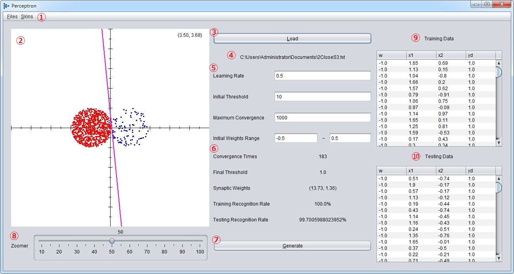
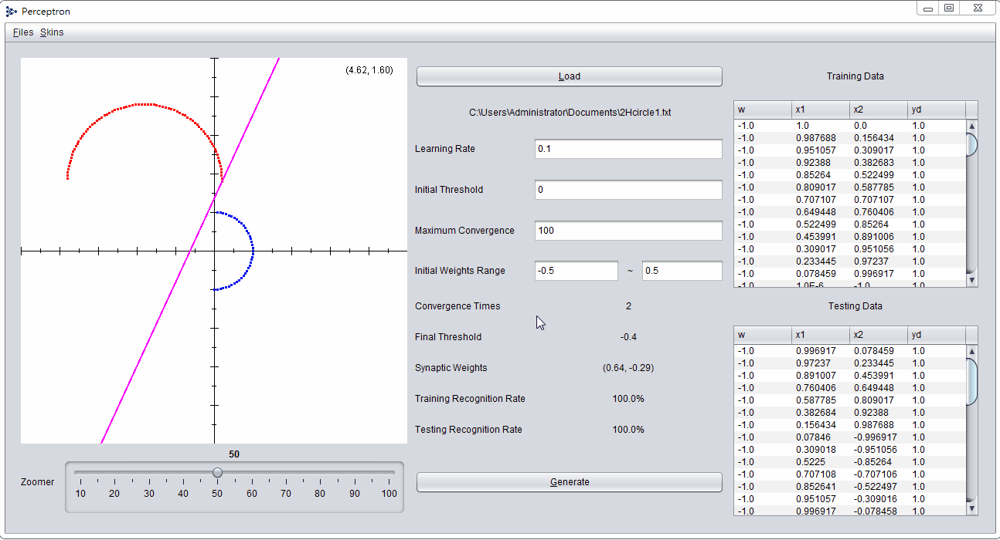
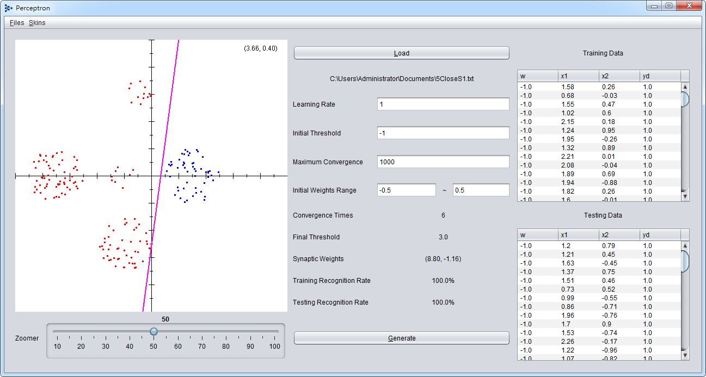
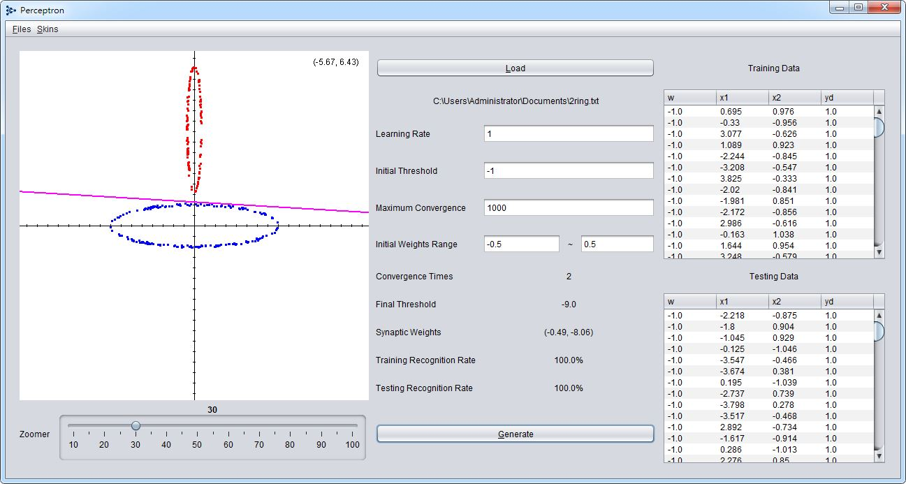

# Single-Layer Perceptron

Using Java Swing to implement single-layer perceptron neural network. Learning algorithm can refer to [this](https://en.wikipedia.org/wiki/Perceptron#Learning_algorithm) Wikipedia page. 

Input consists of several groups of multi-dimensional data set, The data were cut into three parts (each number roughly equal to the same group), 2/3 of the data given to training function, and the remaining 1/3 of the data given to testing function.

The purpose of program is training to cut a number of groups of hyperplanes and synaptic weights, and display the results in the graphical interface.

## Getting Started

	git clone https://github.com/Jasonnor/Perceptron.git
    cd Perceptron
    Perceptron.jar

1. Operation menu (Files, Skins)
2. Output the result screen
3. Read the file
4. File path
5. Adjustable parameters
6. Output the result
7. Generate new results
8. Adjust the output image screen zoom level
9. List of training materials (2/3 of total data)
10. List of test data (1/3 of total data)

You can use these [data sets](data) for testing.

## Demo

## Contributing

Please feel free to use it if you are interested in fixing issues and contributing directly to the code base.

## License

Perceptron is released under the MIT license. See the [LICENSE](/LICENSE) file for details.
